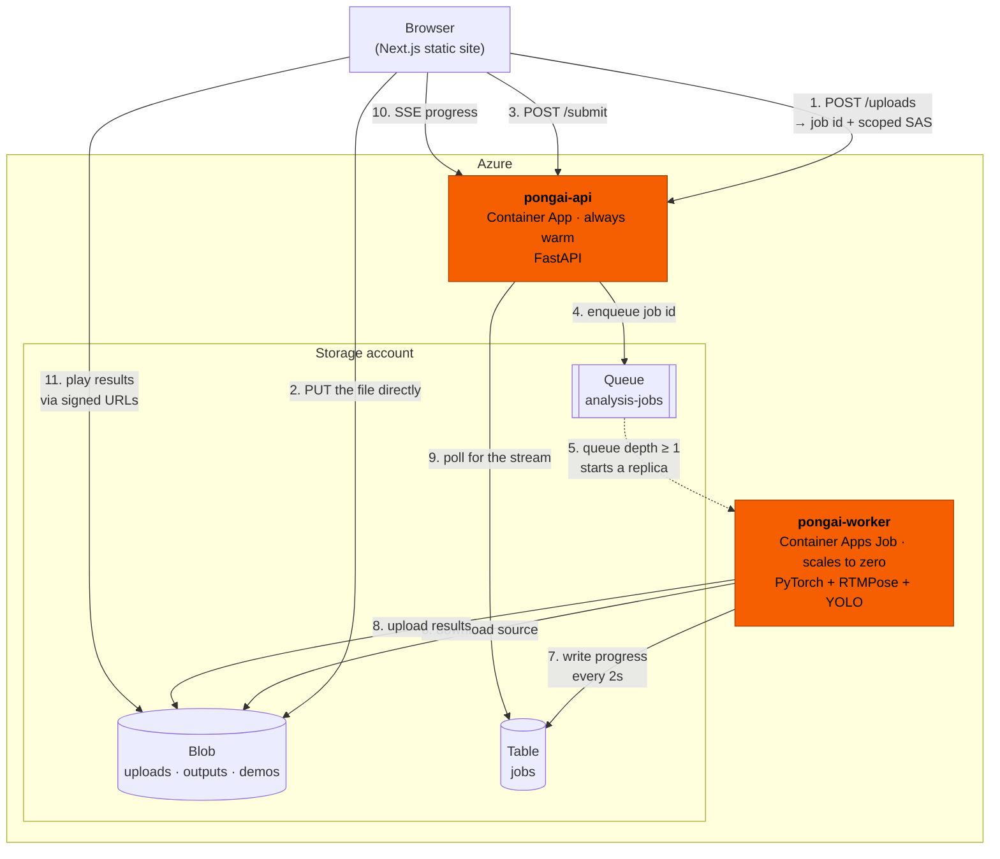

# PongAI — Backend

Table-tennis video analysis from body pose alone. Upload a match, get back
every shot: when it happened, who played it, what kind of stroke it was, and
13 measured kinematics.

No ball tracking, no racket detection — the models read the players' bodies.

---

## What it does

1. A browser uploads a match video straight to blob storage.
2. The job is queued.
3. A GPU/CPU worker picks it up and runs the pipeline:
   find the rallies → track both players' skeletons → detect the moment of
   contact → attribute each shot to a player → classify the stroke → measure it.
4. The result is a rendered video with skeletons drawn on, plus a JSON record
   of every shot.

A 5-minute clip is roughly 25 minutes of work on a T4, so nothing about this
is request/response — the whole design is built around a long job the user
watches progress through.

---

## Architecture



### How to read that

**The API and the worker never talk to each other.** The worker writes job
state to Table Storage; the API polls that table to drive its progress stream.
So the API can restart mid-job with no effect, and the worker never needs the
API to be up.

**Video never passes through the API.** Uploads go browser → blob directly
using a SAS token scoped to one path, and results come back as signed URLs. A
100 MB body through the API would occupy a worker for the whole upload and hit
request size limits.

**The API is always warm; the worker scales to zero.** The SSE endpoint holds
connections open for 25–40 minutes, so a cold start mid-stream would drop them.
The worker is where the cost is, so it only exists while a video is being
analysed.

**Upload and submit are separate steps.** A SAS can be issued and the upload
then fail at 70%. Submit is where the API verifies the blob actually landed at
its stated size, so a truncated upload is caught immediately rather than deep
in the pipeline half an hour later.

---

## Code structure

```
pongai/
├── core/       imported by BOTH services
├── api/        FastAPI — HTTP, always running
└── worker/     the pipeline — runs to completion, exits
```

The import rule, and the whole reason `core` exists:

```
api    → core     yes
worker → core     yes
api    → worker   never
worker → api      never
```

### `pongai/core/` — the shared contract

Everything both services must agree on. Split across two packages they would
drift within a month, and the failure is quiet: a user gets one rejection
message at upload and a different one an hour later.

| file | what it holds |
|---|---|
| `schema.py` | the data contract — `Shot`, `Analysis`, `Job`, the job state machine, and model facts like per-class precision |
| `validation.py` | one rule set for browser, API and worker: size, duration, frame rate, resolution, aspect, and the camera-angle check |
| `storage.py` | all Azure access — blob, queue, table, SAS signing |
| `progress.py` | weighted stage progress and the reporter the worker writes through |

### `pongai/api/` — the HTTP service

| file | what it does |
|---|---|
| `main.py` | app setup, CORS, error handlers |
| `deps.py` | shared dependencies, job-id validation |
| `errors.py` | one error envelope for every failure |
| `routes/uploads.py` | issue a SAS, verify the blob, enqueue |
| `routes/jobs.py` | progress stream, polling, retry, source, delete |
| `routes/analyses.py` | the finished result |
| `routes/meta.py` | health, limits, demos |

### `pongai/worker/` — the pipeline

| file | what it does |
|---|---|
| `run.py` | pulls one job off the queue, runs it, exits |
| `pipeline.py` | orchestrates the stages, writes the artifacts |
| `device.py` | resolves CUDA vs CPU |
| `stages/video.py` | decode, activity gate, pose extraction, render |
| `stages/geometry.py` | skeleton layout, canonicalisation, frame-rate resampling |
| `stages/analysis.py` | contact detection, classification, kinematics, rallies |
| `stages/nets.py` | the two trained model architectures |
| `weights/` | model files, baked into the image (not in git) |

### Everything else

| folder | what it does |
|---|---|
| `tests/` | pytest suite — no Azure, no GPU needed |
| `docker/` | one image per service, plus a CPU worker variant |
| `infra/` | `deploy.sh` — provisions and deploys everything |
| `scripts/` | `check_storage.py` — verifies a storage account end to end |

---

## API

| route | purpose |
|---|---|
| `GET /api/health` | liveness — deliberately does not touch storage |
| `GET /api/ready` | readiness — does |
| `GET /api/limits` | constraints + model capability, so the browser and the worker agree |
| `POST /api/uploads` | → job id + scoped SAS |
| `POST /api/jobs/{id}/submit` | verify the blob landed, enqueue |
| `GET /api/jobs/{id}/stream` | **SSE** progress |
| `GET /api/jobs/{id}` | polling fallback |
| `GET /api/jobs` | history |
| `GET /api/jobs/{id}/source` | short-lived link to the raw upload |
| `POST /api/jobs/{id}/retry` | re-run a failed job on the same upload |
| `DELETE /api/jobs/{id}` | remove the job and everything it stored |
| `GET /api/analyses/{id}` | results + signed URLs |
| `GET /api/demos`, `GET /api/demos/{id}` | precomputed matches |

Interactive docs at `/docs` once the API is running.

---

## Azure

Everything lives in the `rgTableTennisAI` resource group.

| resource | type | role |
|---|---|---|
| `blobtabletennisai` | Storage account | blob + queue + table, all three |
| `pongai-api` | Container App | the API, min 1 replica |
| `pongai-worker` | Container Apps **Job** | queue-triggered, scales to zero |
| `pongai-env` | Container Apps environment | hosts both |
| `pongaiacr` | Container Registry | both images |
| `stTableTennisAI` | Static Web App | the frontend |

The storage account is the only piece all three tiers share:

- **Blob** — `uploads/` (raw video, deleted after 7 days), `outputs/` (rendered
  video, shot records, crop track, thumbnail), `demos/`
- **Queue** — `analysis-jobs`, one message per job, and what triggers the worker
- **Table** — `jobs`, the job records the API polls for progress

### Deploying

```bash
./infra/deploy.sh
```

Idempotent and safe to re-run. It builds both images **in ACR** rather than
locally — Container Apps runs x86_64, and a build on an Apple Silicon Mac
produces arm64 images that fail with `exec format error`.

The worker currently runs on **CPU** (`docker/worker.cpu.Dockerfile`), roughly
14x realtime. Moving it to a T4 needs GPU quota via a support case, then adding
the workload profile and passing `--workload-profile-name gpu-t4`.

---

## Running locally

### Requirements

| | |
|---|---|
| **Python** | 3.11 or newer |
| **ffmpeg** | required — the worker probes and encodes with it (`brew install ffmpeg`) |
| **Azure** | a storage account connection string; the API creates the containers, queue and table itself on first start |
| **Disk** | ~1.5 GB for the worker dependencies (torch, ultralytics, opencv) |
| **GPU** | optional — set `PONGAI_DEVICE=cpu` to run without one |

The API alone needs none of the heavy dependencies. Only the worker does.

### Setup

```bash
cd Backend
python3 -m venv .venv
.venv/bin/pip install -e ".[api]"        # API only
.venv/bin/pip install -e ".[api,worker]" # ...or with the pipeline

cp .env.example .env                     # then paste your connection string
```

Get the connection string from the Azure portal: **storage account → Security +
networking → Access keys → Connection string**. Quote it in `.env` — it contains
`;`, which the shell treats as a command separator.

### Check the storage account

```bash
set -a && source .env && set +a
.venv/bin/python scripts/check_storage.py --fix
```

Creates anything missing and proves the credentials work with a real SAS
round-trip. `--fix` is optional; without it the script only reports.

### Run the API

```bash
set -a && source .env && set +a
.venv/bin/uvicorn pongai.api.main:app --reload --port 8000
```

`GET /api/ready` returning `{"status":"ready","queue_depth":0}` means it is up
**and** talking to Azure.

### Run the worker

```bash
set -a && source .env && set +a
PONGAI_DEVICE=cpu .venv/bin/python -m pongai.worker.run
```

It takes one job off the queue, processes it, and exits — the same thing the
container does. Pass a job id as an argument to run a specific one.

Model weights must be present in `pongai/worker/weights/`. They are gitignored
(~121 MB), so copy them in from a teammate or a release.

### Tests

```bash
.venv/bin/python -m pytest
```

No Azure and no GPU. Worker tests skip automatically without the `worker`
extra installed.

---

## Browser CORS

The browser PUTs directly to blob storage, so the **storage account** needs its
own CORS rule — the API's `ALLOWED_ORIGINS` does not cover it:

```bash
az storage cors add --services b --methods PUT OPTIONS GET HEAD \
  --origins "http://localhost:3000" --allowed-headers '*' \
  --exposed-headers '*' --max-age 3600 --account-name blobtabletennisai
```

Without it, uploads fail in the browser with an opaque CORS error that looks
like a bug in the frontend.
