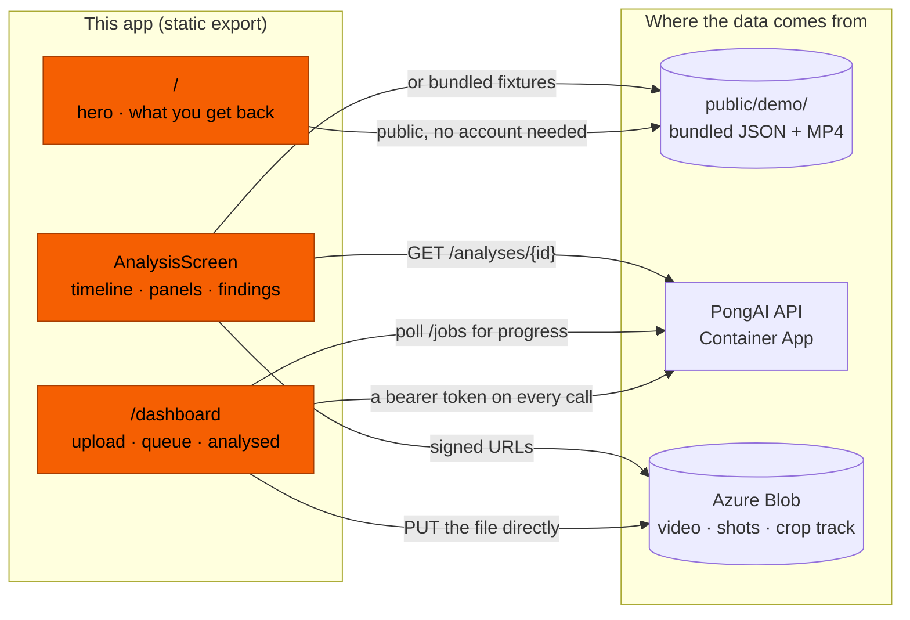

# PongAI — Frontend

Web interface for a table-tennis video analysis system that works from **body
pose alone** — it never tracks the ball.

Upload a match, watch it analyse, then read every shot: when it happened, who
played it, what stroke it was, and 13 measured kinematics.

**Stack:** Next.js 16 (App Router) · React 19 · TypeScript (strict) ·
Tailwind CSS v4

---

## What it does

1. **Sign in.** Uploads and analyses are private to your account. The demo
   matches need no account at all.
2. **Pick a video.** The file is measured in the browser first, so a clip that
   cannot work is caught before 100 MB is uploaded rather than after.
3. **Upload it** straight to Azure Blob Storage, using a short-lived link the
   API issues. The video never passes through the API.
4. **Analyse it.** The job goes to a queue; a worker picks it up. The page
   shows weighted progress, the current stage and an estimate.
5. **Read the result** — video with skeletons drawn on, a shot timeline,
   per-player analytics and findings.

Bundled demo matches are available without uploading anything.

---

## Architecture



### How to read that

**It is a static export.** `next.config.ts` sets `output: "export"`, so there
is no server: every route is prerendered at build time and every API call runs
in the visitor's browser. That is also why the API base URL is baked in at
build time rather than read at runtime.

**One screen renders both demos and real analyses.** `AnalysisScreen` takes a
`live` flag that changes _only where the bytes come from_ — bundled JSON, or
the API plus signed blob URLs. Everything below it is shared. A second screen
for real matches is how the two would quietly stop agreeing.

**Demo ids are known at build time; job ids are not.** So demos live at
`/analysis/{id}` (prerendered from the registry) and uploads live at
`/analysis/job/?id=…`, a static route that reads the id client-side. A static
segment wins over the sibling dynamic route, so the two do not collide.

**Marketing and workspace are separate pages.** `/` sells the product;
`/dashboard` is where your videos live. They were one page for a while, and the
tell was the header's "Upload video" button having to scroll to an anchor
buried in a marketing page rather than simply navigating.

**The session guard runs in the browser**, because a static export has no
server to redirect before the page is served. That is not the security
boundary: the API returns 401 without a token, and 404 for another account's
job. The guard only avoids showing an empty shell.

---

## Routes

| route                                   | what it is                                    |
| --------------------------------------- | --------------------------------------------- |
| `/`                                     | the hero, and what an analysis looks like     |
| `/dashboard`                            | upload, the queue, and your finished analyses |
| `/analysis/{id}`                        | a bundled demo match, prerendered             |
| `/analysis/job/?id=…`                   | one of your uploads                           |
| `/signin`, `/signup`                    | accounts                                      |
| `/profile`                              | your account                                  |
| `/how-it-works`, `/contact`, `/privacy` | the footer pages                              |

---

## Code structure

```
src/
├── app/           routes (App Router) + the design system
├── components/    UI
└── lib/           data loading, contracts, pure logic
```

### `src/app/`

| file                     | what it is                                                              |
| ------------------------ | ----------------------------------------------------------------------- |
| `globals.css`            | the design system — colour tokens, the six-step type scale, base styles |
| `layout.tsx`             | root layout, metadata, global chrome                                    |
| `page.tsx`               | home                                                                    |
| `analysis/[id]/page.tsx` | demo matches, prerendered from the registry                             |
| `analysis/job/page.tsx`  | an uploaded analysis, read from `?id=`                                  |

### `src/components/`

**Accounts and chrome**

| file                                 | what it does                                         |
| ------------------------------------ | ---------------------------------------------------- |
| `session-provider.tsx`               | `useSession`, reading the token store directly       |
| `auth-form.tsx`                      | sign in and sign up, sharing one form                |
| `account-menu.tsx`                   | the header avatar, profile and sign out              |
| `require-session.tsx`                | the client-side guard on `/dashboard` and `/profile` |
| `profile-view.tsx`                   | the account page                                     |
| `hero.tsx`                           | the looping rally, the wordmark, the calls to action |
| `dashboard-glimpse.tsx`              | a real capture of the analysis screen                |
| `site-header.tsx`, `site-footer.tsx` | global chrome                                        |

**Upload and the queue**

| file                  | what it does                                        |
| --------------------- | --------------------------------------------------- |
| `upload-section.tsx`  | owns the job list both lists on the dashboard read  |
| `upload-panel.tsx`    | the picker — probe, validate, upload with progress  |
| `uploaded-videos.tsx` | videos waiting, with progress and per-video actions |
| `analysed-videos.tsx` | finished analyses, as cards                         |
| `video-overlay.tsx`   | plays a raw upload back, and acts on it             |
| `confirm-dialog.tsx`  | shared confirmation, on the native `<dialog>`       |

**The analysis screen**

| file                                          | what it does                                            |
| --------------------------------------------- | ------------------------------------------------------- |
| `analysis-screen.tsx`                         | the whole match view; the only place `live` matters     |
| `video-stage.tsx`                             | the shared `<video>` every panel reads from             |
| `crop-view.tsx`                               | a zoomed crop of one player, taken from that same video |
| `skeleton-panel.tsx`                          | canvas skeleton for a single shot window                |
| `shot-timeline.tsx`                           | every shot on a scrubber                                |
| `match-analytics.tsx`, `player-analytics.tsx` | the charts                                              |
| `findings-section.tsx`, `evidence-mode.tsx`   | claims, and the clips behind them                       |
| `pose-clip.tsx`                               | a small looping pose animation                          |
| `what-this-measures.tsx`                      | capability boundaries, stated plainly                   |

### `src/lib/`

| file                                       | what it holds                                       |
| ------------------------------------------ | --------------------------------------------------- |
| `types.ts`                                 | the backend data contract — `Shot`, `Analysis`      |
| `api-types.ts`                             | the job/upload half of that contract                |
| `api.ts`                                   | the API client, including the direct-to-blob upload |
| `constants.ts`                             | pose geometry, kinematic groups, class reliability  |
| `probe.ts`                                 | measuring a video file in the browser               |
| `upload-validation.ts`                     | the browser's copy of the upload rules              |
| `analysis.ts`, `real-demo.ts`              | loading bundled matches and crop tracks             |
| `live-analysis.ts`                         | loading an analysis from the API                    |
| `findings.ts`, `rally-segments.ts`         | pure logic, unit-tested                             |
| `use-playback.ts`, `use-video-playback.ts` | the two clocks a match can run on                   |

---

## The rules that shape the code

Not stylistic preferences — each exists because of how the model actually
behaves.

1. **Brand orange is a fill, never text on the background.** `#f55f02` on
   `#e6e0dc` is 2.46:1 and fails WCAG AA. Use `text-brand-text` (`#a63e02`,
   4.85:1) when orange-looking text is needed. Orange buttons take **black**
   text.
2. **Uncertain shots must look uncertain.** `control` and `defence` are 80% and
   56% precise. Anything with `abstain === true` is de-emphasised and never
   feeds a headline claim.
3. **Velocity kinematics are absent below 60fps, not greyed.** At 30fps the
   wrist-speed peak is under-measured by ~54%. Gate on the API's
   `velocity_reliable` rather than re-deriving the threshold.
4. **Colour never carries meaning alone.** Every shot marker also carries its
   `S` / `A` / `C` / `D` letter.
5. **One decode per screen.** The match video is decoded once; the player
   panels are canvases cropping from that same element, driven by one shared
   rAF loop. Real analyses have the skeleton drawn into the video by the
   pipeline, so nothing is overlaid — only bundled demos draw skeletons in the
   browser, from pose windows.

Only six type sizes exist (12/14/16/20/28/40). Tailwind's default scale is
reset in `globals.css`, so an out-of-scale size fails loudly. There is one
documented exception, `--text-display`, for the hero wordmark: 40px is lost
against full-bleed video, and it clamps down to exactly that on a phone.

---

## Running locally

### Requirements

|          |                                                       |
| -------- | ----------------------------------------------------- |
| **Node** | 22 or newer (CI builds on 22)                         |
| **API**  | a running PongAI backend — see `../Backend/README.md` |

### Setup

```bash
npm install
cp .env.example .env.local     # then point it at your API
npm run dev                    # http://localhost:3000
```

`.env.local` holds one variable:

```
NEXT_PUBLIC_API_URL=http://localhost:8000
```

Leave it unset and the app falls back to `http://localhost:8000`. Point it at
the deployed Container App to develop against real data without running a
backend at all.

`NEXT_PUBLIC_*` is **inlined into the bundle at build time**, so it must be set
when the app is _built_, not when it is served — and it is public by
construction.

> The upload goes straight from the browser to blob storage, so the **storage
> account** needs a CORS rule for your origin. The API's own CORS settings do
> not cover it. See `../Backend/README.md`.

### Scripts

| script                  | what it does                                      |
| ----------------------- | ------------------------------------------------- |
| `npm run dev`           | dev server (Turbopack)                            |
| `npm run build`         | static export into `out/`                         |
| `npm run typecheck`     | `tsc --noEmit`                                    |
| `npm run lint`          | ESLint                                            |
| `npm run test`          | unit tests for the pure logic in `lib/`           |
| `npm run format`        | Prettier, with Tailwind class sorting             |
| `npm run generate:demo` | rebuild the demo fixtures (runs before dev/build) |

`scripts/capture-dashboard.mjs` retakes the screenshot on the landing page. It
is not part of any build; see `public/hero/README.md` for when and how.

> If `typecheck` reports a missing route type, run `npx next typegen` — Next
> generates `PageProps` from the file system, and a new route needs one pass
> first.

---

## Deployment

Azure Static Web Apps (`stTableTennisAI`), built and deployed by GitHub Actions
on every push to `main`.

The workflow sets `NEXT_PUBLIC_API_URL` for the build step, runs
`npm run build`, and uploads `Frontend/out`. Nothing needs configuring in the
repo — the API URL lives in the workflow, with a `vars.NEXT_PUBLIC_API_URL`
override if it ever needs to differ.

Pull requests get a preview environment. The Free tier allows **three** at a
time; if a build fails with "maximum number of staging environments", delete
the stale ones:

```bash
az staticwebapp environment list -n stTableTennisAI -g rgTableTennisAI -o table
az staticwebapp environment delete -n stTableTennisAI -g rgTableTennisAI \
  --environment-name <name> --yes
```
